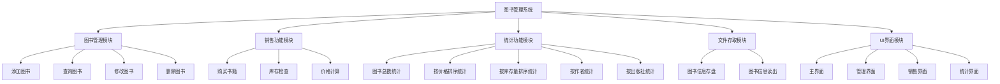
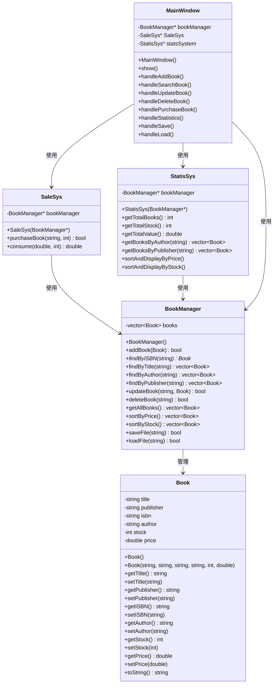

# 图书管理系统设计文档

## 1. 系统功能模块框图



## 2. 系统类层次结构



## 3. 核心类设计

### 3.1 Book类
- **属性**：书名、出版社、ISBN号、作者、库存量、价格
- **方法**：构造函数、getter/setter方法、字符串转换方法

### 3.2 BookManager类
- **属性**：图书容器（vector<Book>）
- **方法**：增删改查、排序、文件存取

### 3.3 SalesSystem类
- **属性**：指向BookManager的指针
- **方法**：购买书籍、价格计算

### 3.4 StatisticsSystem类
- **属性**：指向BookManager的指针
- **方法**：各类统计功能

### 3.5 MainWindow类
- **属性**：各系统指针、UI组件
- **方法**：界面事件处理、功能调用

## 4. 文件结构设计

```
BMS/
├── include/
│   ├── Book.h
│   ├── BookManager.h
│   ├── SaleSys.h
│   ├── StatisSys.h
│   └── MainWindow.h
├── src/
│   ├── Book.cpp
│   ├── BookManager.cpp
│   ├── SaleSys.cpp
│   ├── StatisSys.cpp
│   ├── MainWindow.cpp
│   └── main.cpp
├── data/
│   └── books.dat
├── docs/
│   └── system_design.md
└── CMakeLists.txt
```

## 5. 技术栈

- **语言**：C++11
- **UI库**：FLTK 1.3.x
- **数据结构**：std::vector
- **文件格式**：二进制序列化
- **编译系统**：CMake

## 6. 实现优先级

1. 核心数据类（Book, BookManager）
2. 业务逻辑类（SaleSys, StatisticsSystem）
3. 文件存取功能
4. UI界面开发
5. 系统集成测试